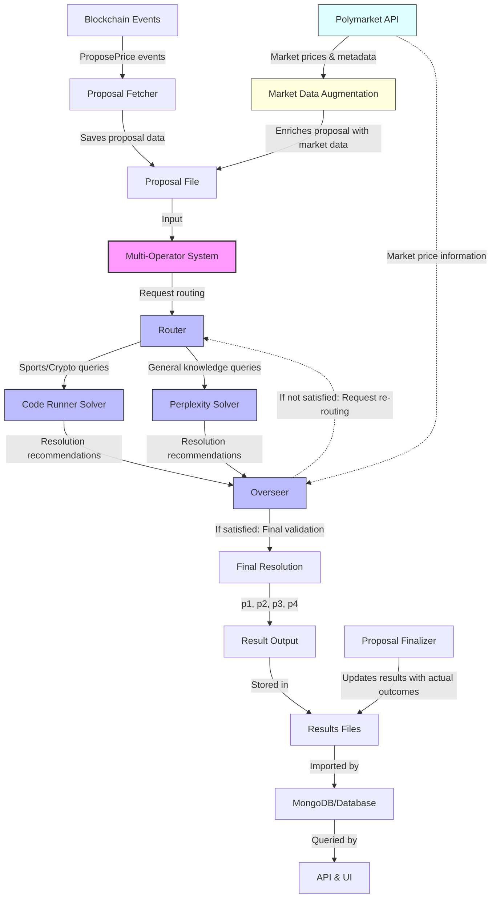

# 🔮 Optimistic Truth Bot

<p align="center">
  
</p>

Multi-agent system for resolving Polymarket prediction market proposals with high accuracy using LLMs.

## Table of Contents

- [Optimistic Truth Bot](#optimistic-truth-bot)
  - [Table of Contents](#table-of-contents)
  - [Overview](#overview)
  - [System Architecture](#system-architecture)
    - [Router](#router)
    - [Solvers](#solvers)
      - [Perplexity Solver](#perplexity-solver)
      - [Code Runner Solver](#code-runner-solver)
    - [Overseer](#overseer)
    - [Prompts](#prompts)
  - [Getting Started](#getting-started)
  - [Results and Experiments](#results-and-experiments)
  - [Database Integration](#database-integration)
    - [Prerequisites](#prerequisites)
    - [Installation](#installation)
    - [Configuration](#configuration)
  - [Running the System](#running-the-system)
    - [Proposal Fetcher](#proposal-fetcher)
    - [Multi-Operator Early Request Retry](#multi-operator-early-request-retry)
    - [Output Watcher](#output-watcher)
    - [Proposal Finalizer](#proposal-finalizer)
    - [User Interface](#user-interface)
  - [Development](#development)
  - [License](#license)

## 📋 Overview

The Optimistic Truth Bot is a sophisticated system designed to monitor, process, and resolve Polymarket prediction market proposals. The system combines multiple AI strategies, including search-based solvers and code execution solvers, to provide accurate resolution recommendations.

The workflow involves:

1. Monitoring Polymarket blockchain events for new proposals
2. Saving proposal information to structured files
3. Processing proposals through multi-agent decision-making
4. Submitting resolution recommendations
5. Tracking performance against actual market outcomes

## 🏗️ System Architecture

The Optimistic Truth Bot system consists of several key components:



### 🔀 Router

The Router is responsible for deciding which solver to use for each Polymarket proposal. It analyzes the content of the proposal and makes intelligent routing decisions based on the type of query and available solvers. The Router can select multiple solvers for complementary approaches to the same question.

### 🧩 Solvers

The system currently employs two primary solver types:

#### 🔎 Perplexity Solver

The Perplexity Solver leverages the Perplexity API to search the internet and retrieve information relevant to the proposal. It's engineered to handle a wide range of query types and includes validations to avoid hallucinations and maintain accuracy.

Key features:
- Web search capability
- Information synthesis from multiple sources
- Handling of complex queries requiring context

#### 💻 Code Runner Solver

The Code Runner Solver generates and executes Python code to solve specific types of proposals through direct API access. It's primarily used for:
- 📈 Cryptocurrency price queries (via Binance API)
- 🏆 Sports data retrieval (via Sports Data IO API)

The Code Runner includes sample code templates that are adapted to each query, allowing for precise data retrieval and processing. It accesses environment variables from the `.env` file to securely utilize API keys without hardcoding them.

**Sample Code Templates:**
- [Cryptocurrency Price Queries](multi_operator/solvers/code_runner/sample_functions/query_binance_price.py) - Uses Binance API to fetch historical price data with timezone conversion
- [MLB Sports Data](multi_operator/solvers/code_runner/sample_functions/query_sports_mlb_data.py) - Fetches baseball game scores and outcomes
- [NHL Sports Data](multi_operator/solvers/code_runner/sample_functions/query_sports_nhl_data.py) - Retrieves hockey game results
- [NFL Sports Data](multi_operator/solvers/code_runner/sample_functions/query_sports_nfl_data.py) - Gets football game data

When a proposal is routed to the Code Runner, it:
1. Analyzes the query to determine the data type needed
2. Generates customized Python code based on the appropriate template
3. Runs the code in a controlled environment with access to configured API keys
4. Captures the output and extracts the recommendation (p1, p2, p3, or p4)

The sample code templates provide robust error handling, timezone conversion, API fallbacks, and clear output formatting to ensure consistent results.

### 👀 Overseer

The Overseer evaluates solver responses for quality and accuracy with a strong focus on market alignment. It can:
- ✅ Validate responses against market data
- 🔄 Request reruns from solvers if needed
- 📝 Provide guidance for improving responses
- 🎯 Make final recommendations on which solver's output to use
- 📊 Compare recommendations with Polymarket price data

The Overseer receives token price information from Polymarket and uses it to ensure that solver recommendations don't diverge significantly from market sentiment. When market prices strongly favor a particular outcome (>85% confidence), the Overseer will flag any contradicting recommendations for review. This market alignment check is crucial for preventing incorrect or misleading outputs, especially in cases where:

1. The solver misinterpreted data or made calculation errors
2. The solver lacks critical context captured by market participants
3. Date/time mismatches exist between the query and the solver's interpretation

For Code Runner solutions, the Overseer performs additional validation by checking date/time formats, timezone conversions, and API data retrieval logic to ensure technical accuracy.

### 📝 Prompts

The system uses carefully crafted prompts for each component, stored in the [multi_operator/prompts](multi_operator/prompts/) directory:

- [**Perplexity Prompts**](multi_operator/prompts/perplexity_prompt.py): System prompts for the Perplexity solver to guide its information search and evaluation
- [**Router Prompts**](multi_operator/prompts/router_prompt.py): Prompts used by the Router to analyze queries and choose appropriate solvers
- [**Overseer Prompts**](multi_operator/prompts/overseer_prompt.py): Prompts for the Overseer to evaluate solver responses and check market alignment
- [**Code Runner Prompts**](multi_operator/prompts/code_runner_prompt.py): Prompts for generating Python code based on query requirements

These prompt files contain multiple versions and templates that guide the behavior of the AI models at each stage of processing. They are designed to ensure consistent, accurate, and well-reasoned responses for different types of market questions.

## 🚀 Getting Started

### 📋 Prerequisites

- Python 3.8+
- MongoDB (for database storage)
- API keys:
  - OpenAI API key
  - Perplexity API key
  - Sports Data IO API key (for sports data)
  - Other optional API keys based on use cases

### 🔧 Installation

1. Clone the repository:
   ```bash
   git clone https://github.com/yourusername/optimistic-truth-bot.git
   cd optimistic-truth-bot
   ```

2. Create and activate a virtual environment:
   ```bash
   python -m venv venv
   source venv/bin/activate  # On Windows: venv\Scripts\activate
   ```

3. Install dependencies:
   ```bash
   pip install -r requirements.txt
   ```

### ⚙️ Configuration

1. Create a `.env` file with your API keys:
   ```
   OPENAI_API_KEY=your_openai_api_key
   PERPLEXITY_API_KEY=your_perplexity_api_key
   SPORTS_DATA_IO_MLB_API_KEY=your_sports_data_io_mlb_api_key
   SPORTS_DATA_IO_NHL_API_KEY=your_sports_data_io_nhl_api_key
   POLYGON_RPC_URL=your_polygon_rpc_url
   MONGO_URI=your_mongodb_connection_string
   ```

2. Configure `api_keys_config.json` with additional API keys and endpoints needed for the Code Runner solver:

   The `api_keys_config.json` file provides structured configuration for data sources and API keys:
   
   ```json
   {
     "data_sources": [
       {
         "name": "Binance Cryptocurrency",
         "category": "crypto",
         "description": "Binance API for cryptocurrency price data",
         "api_keys": ["BINANCE_API_KEY"],
         "endpoints": {
           "primary": "https://api.binance.com/api/v3",
           "proxy": "https://your-proxy-endpoint.com/binance"
         },
         "example_queries": [
           "What was the price of BTC on March 30?",
           "How much did Ethereum cost yesterday?"
         ]
       },
       {
         "name": "Sports Data IO",
         "category": "sports",
         "subcategory": "MLB",
         "description": "Sports Data IO API for baseball statistics",
         "api_keys": ["SPORTS_DATA_IO_MLB_API_KEY"],
         "endpoints": {
           "primary": "https://api.sportsdata.io/v3/mlb"
         },
         "example_queries": [
           "Did the Blue Jays win against the Orioles?",
           "What was the score of the Yankees game?"
         ]
       },
       {
         "name": "Sports Data IO",
         "category": "sports",
         "subcategory": "NHL",
         "description": "Sports Data IO API for hockey statistics",
         "api_keys": ["SPORTS_DATA_IO_NHL_API_KEY"],
         "endpoints": {
           "primary": "https://api.sportsdata.io/v3/nhl"
         },
         "example_queries": [
           "Did the Kraken beat the Golden Knights?",
           "What was the score of the Maple Leafs vs Bruins game?"
         ]
       }
     ]
   }
   ```

   This configuration helps the Code Runner solver determine which APIs to use for different types of queries.

## 📊 Results and Experiments

The system stores all processing results in the `results/` directory. This directory contains multiple experiment runs, each in its own subdirectory with a naming convention indicating the date and experiment parameters:

```
results/
  ├── 01042025-multi-operator-with-code-runner/      # April 1, 2025 run with Code Runner enabled
  ├── 04042025-multi-operator-realtime-follower/     # April 4, 2025 realtime follower
  ├── 08042025-multi-operator-with-realtime-bug-fix/ # April 8, 2025 run with bug fixes
  ├── ...
```

Each experiment directory contains:
- A `metadata.json` file describing the experiment configuration
- Output files for each processed proposal (using the format `result_[short_id]_[timestamp].json`)

Results are stored locally by default and don't require a database connection. This allows for easier debugging, version control, and sharing of result files.

## 🗃️ Database Integration and API

The system supports MongoDB integration for storing and querying results, but this is **optional**. By default, all results are saved as JSON files in the `results/` directory.

### Database Integration

```bash
# Test your MongoDB connection
python ./database_utilities/test_db_connection.py

# Import existing results into MongoDB
python ./database_utilities/batch_importer.py --input-dir ./results/your-experiment --database uma_oracle --collection experiments

# Watch for new results and import automatically
python ./database_utilities/output_watcher.py --watch-dir ./results/your-experiment --database uma_oracle --collection experiments
```

MongoDB integration is helpful for:
- Running analytics across multiple experiments
- Serving results through the API and UI
- Querying performance metrics

### API for Results Access

The system includes a RESTful API for querying experiment results stored in MongoDB. This API provides endpoints for:

- Querying by blockchain identifiers (query_id, transaction_hash, condition_id)
- Advanced querying by timestamps, ancillary data, and recommendation values
- Retrieving results by experiment ID or question ID

```bash
# Start the API server
cd api
python main.py
```

The API is hosted at https://api.ai.uma.xyz. You can query it using curl:

```bash
# Query by transaction hash
curl 'https://api.ai.uma.xyz/api/query?transaction_hash=0x3372c0cfb782595199564a1436d1ed1f0d5fe2df931a562752790af2c817114a'

# Advanced query by timestamp range and tags
curl 'https://api.ai.uma.xyz/api/advanced-query?start_timestamp=1741964000&tags=Crypto'
```

For detailed API documentation, see [API Documentation](api/README.md).

## 🔄 Running the System

The system operates through several key scripts that work together to form a complete pipeline:

### 📡 Proposal Fetcher

The Proposal Fetcher listens for ProposePrice events on the blockchain, fetches on-chain data, and saves proposals to JSON files. It ignores negative risk markets.

```bash
python ./utilities/proposal_fetcher.py --start-block 70297560 --proposals-dir ./proposals/current-dataset/proposals
```

Parameters:
- `--start-block`: The block number to start listening from
- `--proposals-dir`: Directory to save proposal JSON files

### 🤖 Multi-Operator Early Request Retry

This script processes proposals, determines the appropriate solver to use, and generates responses with recommendations.

```bash
./multi_operator/run_early_retry.py --output-dir ./results/current-run/outputs --proposals-dir ./proposals/current-dataset/proposals --check-interval 30
```

Parameters:
- `--output-dir`: Directory to save output JSON files
- `--proposals-dir`: Directory containing proposal JSON files to process
- `--check-interval`: Interval in seconds between checking for new proposals

### 👁️ Output Watcher (Optional for MongoDB)

The Output Watcher monitors the results directory for new files and automatically imports them into MongoDB.

```bash
python ./database_utilities/output_watcher.py --watch-dir ./results/current-run --database uma_oracle --collection experiments
```

Parameters:
- `--watch-dir`: Directory containing experiment results to watch
- `--database`: MongoDB database name
- `--collection`: MongoDB collection name

### 🏁 Proposal Finalizer

The Proposal Finalizer checks unresolved proposals/outputs and updates them with final resolution prices from the blockchain.

```bash
python ./utilities/proposal_finalizer.py --continuous
```

Parameters:
- `--continuous`: Run in continuous mode, rechecking proposals periodically
- `--interval`: Interval in seconds between rechecks (default: 30)

### 🖥️ User Interface

The system includes a web-based UI for exploring results and monitoring the system.

```bash
python ./ui/server.py
```

Then open your browser to http://localhost:8000

## 🛠️ Development

The system is organized into several directories:

- `api/`: RESTful API for querying and accessing results from MongoDB (see [API Documentation](api/README.md))
- `database_utilities/`: Tools for MongoDB integration
- `multi_operator/`: Core system components (router, solvers, overseer)
- `proposals/`: Storage for proposal data
- `results/`: Storage for system outputs
- `ui/`: Web-based user interface
- `utilities/`: Various utility scripts

## 📄 License

[MIT License](LICENSE)
